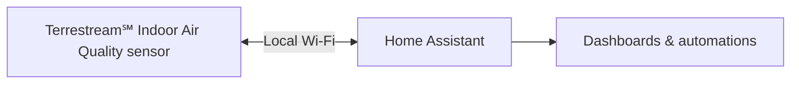

# Terrestream Local for Home Assistant

Connect your **Terrestream℠ Indoor Air Quality sensor** to Home Assistant over
local Wi-Fi. See live readings, adjust settings, and create automations—without
an MQTT broker or a Terrestream account.

**Release preview · September 26, 2026.** Firmware **4.1.0** is available through
Terrestream updates, and the Python client is published. The Home Assistant
integration release is pending. [View release status →](docs/release-status.md)

## One device. Six sensors. 12 signals.

Dedicated CO₂ sensing, laser particle detection, and sensing technology from
Sensirion, Bosch and Texas Instruments bring your room's air and conditions into
one device. [Meet the Terrestream℠ Indoor Air Quality sensor →](https://terrestream.com/sensor)

| Air quality & gases | Particles | Room conditions |
|---|---|---|
|  **CO₂** Carbon dioxide |  **PM1.0** Particles ≤ 1 µm |  **Temperature** Room warmth |
|  **VOC Index** Organic gas changes |  **PM2.5** Particles ≤ 2.5 µm |  **Humidity** Moisture in the air |
|  **NOₓ Index** Oxidizing gas changes |  **PM4.0** Particles ≤ 4 µm |  **Pressure** Barometric pressure |
|  **IAQ** Calculated air quality index |  **PM10** Particles ≤ 10 µm |  **Ambient light** Room brightness |

IAQ is calculated; HA exposes it as **Computed EPA particulate AQI**. VOC and NOx
are indices, not gas concentrations. [Units and measurement details →](docs/user-guide.md#measurements)

## From readings to actionable intelligence

Terrestream's apps and web dashboard combine indoor signals with outdoor conditions
to recognize **over 100 unique situations**—including cooking, cleaning and weather
changes—and help you decide when to ventilate, filter or keep windows closed.
[Explore Terrestream Intelligence →](https://terrestream.com/intelligence)

| In Home Assistant | In Terrestream's apps and website |
|---|---|
| Local readings, saved settings and your own automations | Situation recognition, outdoor context and actionable guidance |
| Runs over your local network | Connected intelligence runs through Terrestream's service |
| No Terrestream account or broker required | A Terrestream account enables connected features; Pro adds further intelligence |

Cloud intelligence and Pro features remain in Terrestream's service. Pairing with
HA preserves your existing settings and cloud-sharing choice.

## Before you start

- Home Assistant **2026.9.3 or newer**.
- Sensor firmware **4.1.0 with native Home Assistant support**. Firmware 4.0.72
  does not support this integration.
- Local network access between Home Assistant and the sensor.
- Internet access for installation and firmware updates. Normal readings and
  controls work locally.

Already using MQTT or the older cloud integration? Follow the
[migration guide](docs/migration.md) first to preserve compatible history.

## Install

**Customer installation opens with the integration release.** Until then, use
[developer setup](CONTRIBUTING.md#development).

| Method | When the integration release is available |
|---|---|
| **HACS** | Add `https://github.com/terrestream/terrestream` as a custom **Integration** repository. Download **Terrestream Local**, then restart Home Assistant. |
| **Manual** | Download the integration ZIP from [Releases](https://github.com/terrestream/terrestream/releases). Copy its `custom_components/terrestream_local` folder into your HA configuration directory, then restart HA. |

Choose an integration release named `v<version>`; `client-v<version>` tags are
for the Python package. [Detailed installation and upgrades →](docs/user-guide.md#installation-and-upgrades)

## Pair in five steps

1. Connect the sensor to Wi-Fi.
2. On its screen, open **Setup → Home Assistant → Pair**.
3. In HA, open **Settings → Devices & services** and select the discovered sensor.
   If it is missing, choose **Add integration → Terrestream Local** and enter its IP address.
4. Enter all **eight digits** of the pairing code, including leading zeros.
   The code expires after two minutes; tap **Pair** for a new one.
5. Choose a name and area, then add readings to your dashboard.

For a new installation, leave **Existing history** set to **New setup**.
[Network settings and pairing help →](docs/user-guide.md#network-and-pairing)

## Everyday use

- **Readings:** 12 measurement entities are enabled by default. Warm-up, cleaning
  and stale readings appear as unavailable, never zero.
- **Settings:** use the sensor's configuration controls in HA. Changes are saved
  on the sensor; no integration reload is needed.
- **Cloud sharing:** **Local only** stops cloud measurement uploads, including
  new readings in the website and mobile app. Update-related traffic may continue.
- **Firmware:** updates come from Terrestream's server. HA connectivity may pause
  briefly during update checks, updates or device setup.

## Help and reference

| Need | Open |
|---|---|
| Pairing, unavailable readings or connection errors | [Troubleshooting](docs/user-guide.md#troubleshooting) |
| Controls, profiles, automations or safe removal | [User guide](docs/user-guide.md) |
| Preserve existing measurement history | [Migration](docs/migration.md) |
| Report a problem | [Issues](https://github.com/terrestream/terrestream/issues) · [Private security reports](SECURITY.md) |
| Develop or contribute | [Contributing](CONTRIBUTING.md) · [Python client](docs/client.md) · [Protocol](docs/protocol.md) |

For support, include HA and firmware versions, reproduction steps, and redacted
integration diagnostics. Keep pairing credentials and HA backups private.

---

Copyright © 2026 Aerodyne Inc. · [terrestream.com](https://terrestream.com)

[Apache License 2.0](LICENSE) · [Notices](NOTICE) · [Third-party notices](THIRD_PARTY_NOTICES.md)

Terrestream is a service mark of Aerodyne Inc. Home Assistant is a trademark of
the Open Home Foundation. Compatibility does not imply certification or endorsement.
See [licensing and marks](docs/licensing.md).
